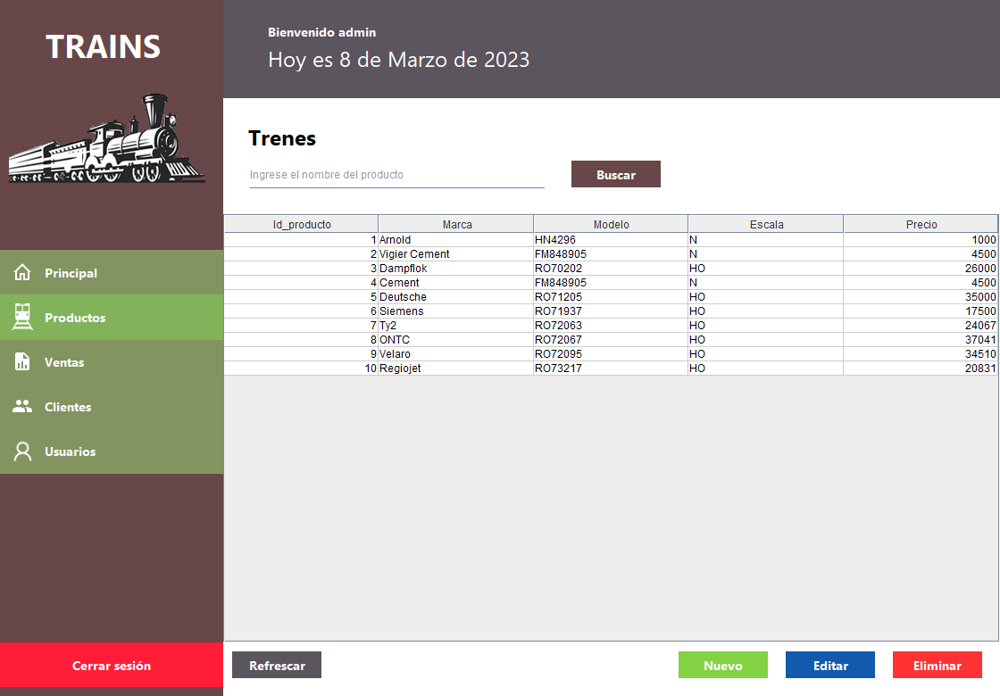

# Sales system



# Table of contents
- [Overview](#overview)
- [Requirements](#requirements)
- [Instalation](#instalation)
- [Login](#login)
- [Notes and possible problems](#notes-and-possible-problems)

# Overview
This project is about a sales system based on scale trains. 
In the **administrator** part you will be able to: **Create**, 
**modify** and **delete** everything related with the database.

In the **User** part yo will be able to: **Buy**, **view your buy history** 
and **see information about all trains**.

# Requirements
In order to run the program it's essential to have the following programs:

- [Java](https://www.java.com/es/download/)

# Instalation
We have to download the **Jar** [file](https://drive.google.com/file/d/11AGyCel1dN-KSsobzwL7-f-moisbmJby/view?usp=share_link) and then run it.

# Login
The admin username and password to can log in to the program are the follows.

|user    |password   |
|--------|-----------|
|admin   |admin      |

# Notes and possible problems
1. If you did the previous steps and it doesn't works, try to run de Jar file
from the console with the next command.

```powershell
java -jar .\jarFileName
```
>Remember be located in the folder what contains the jar file.